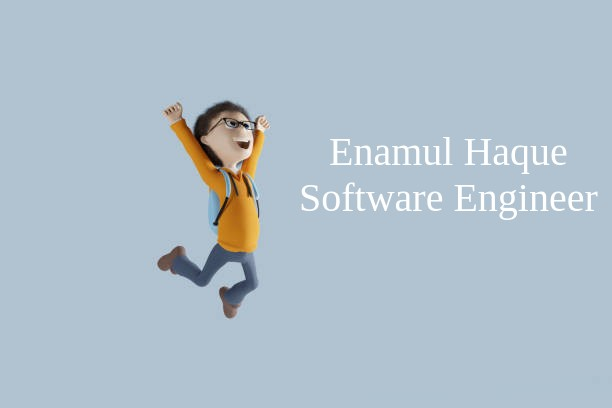

  

 
 
<!--  -->

## :man_office_worker: About me

- :snowman: During my university studies, I spent over 1500 hours working on various types of programming problems.
- :snowman: Solved 300+ problems in different online judges.
- :snowman: Capable of working on multiple stacks simultaneously.
- :snowman: Whenever I switched jobs, I was asked to work on technologies that I had never worked on before. Despite not having any experiences, I always took on those challenges successfully to take over my responsibilities.
   

## :fork_and_knife: Technologies & Tools

## :computer: OS

-->

<!-- Definitions -->

[pabon]: https://github.com/shahnawaz-pabon
[javascript]: https://developer.mozilla.org/en-US/docs/Web/JavaScript
[python]: https://www.python.org/
[reactjs]: https://reactjs.org/
[reactnative]: https://reactnative.dev/
[ionic]: https://ionicframework.com/
[gatsbyjs]: https://www.gatsbyjs.org/
[bash]: https://devhints.io/bash
[docker]: https://www.docker.com/
[visualstudio]: https://code.visualstudio.com/
[atom]: https://atom.io/
[phpstorm]: https://www.jetbrains.com/phpstorm/

